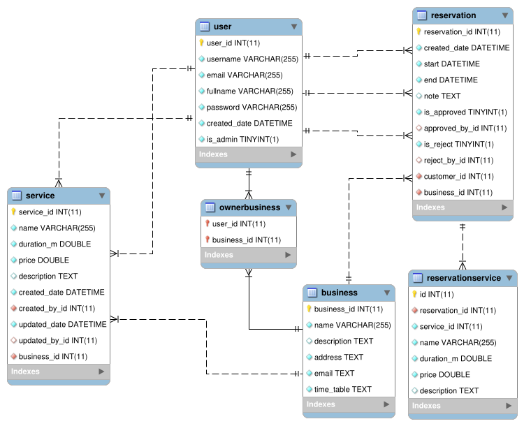
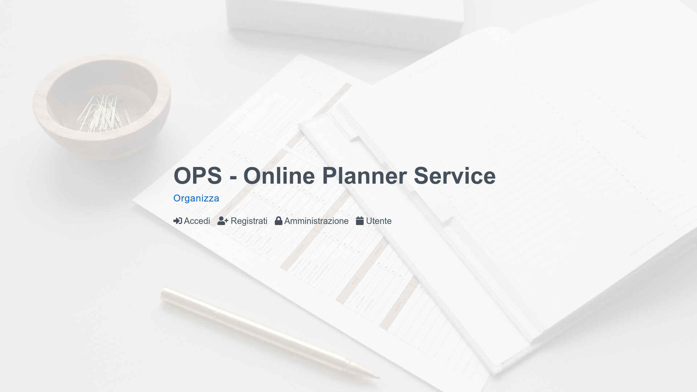
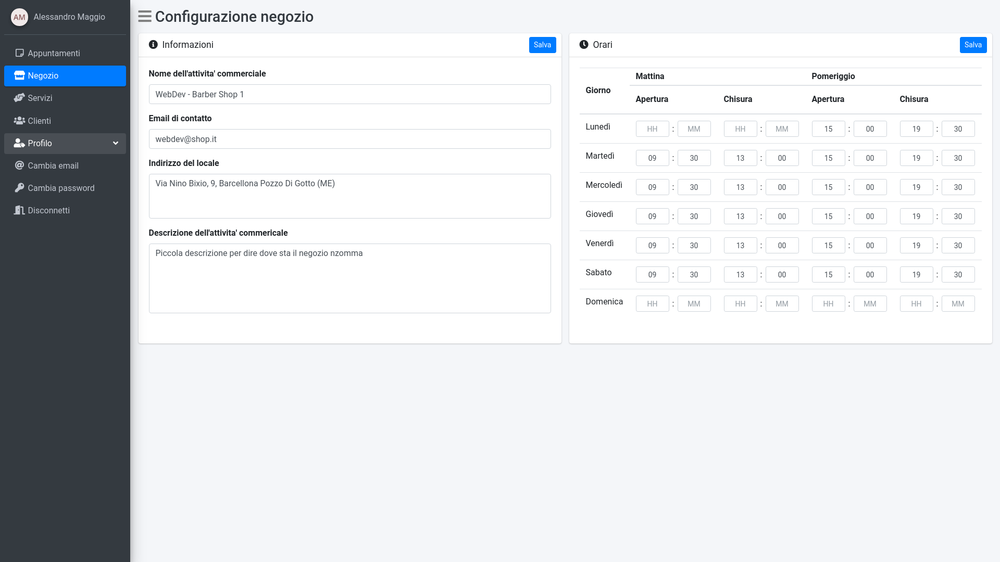
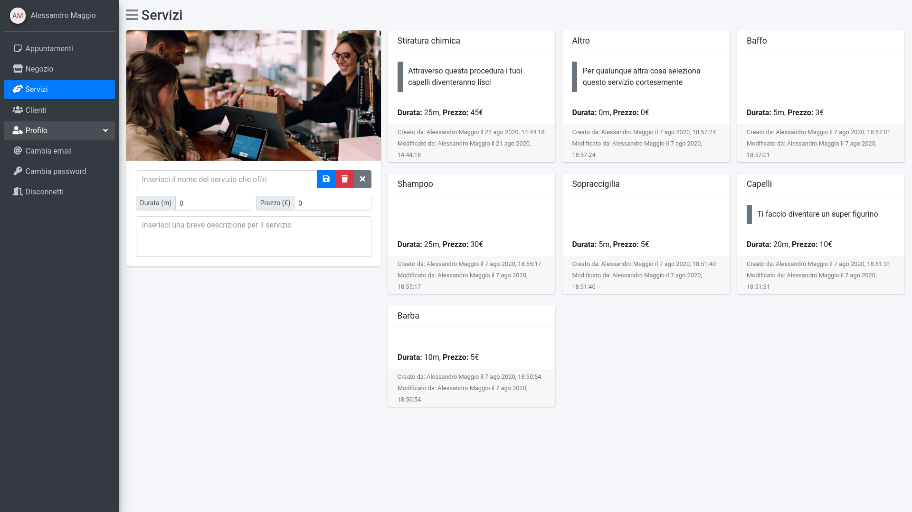
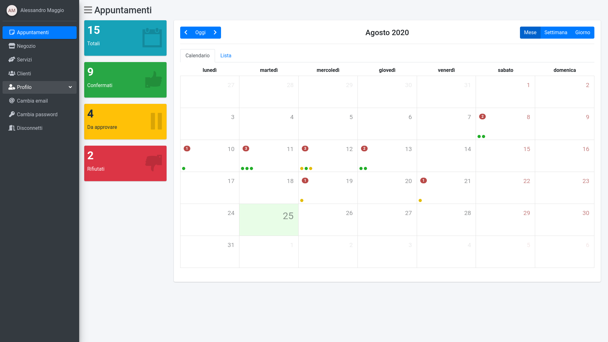
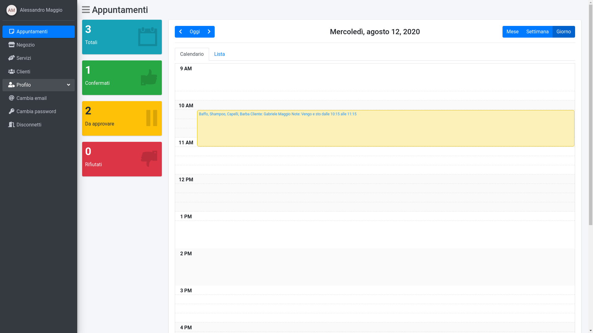
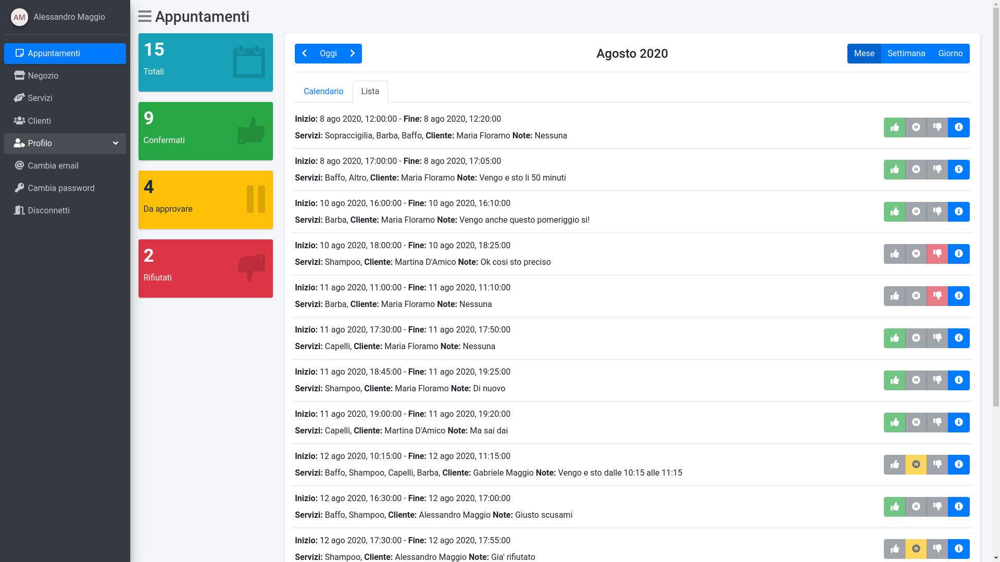
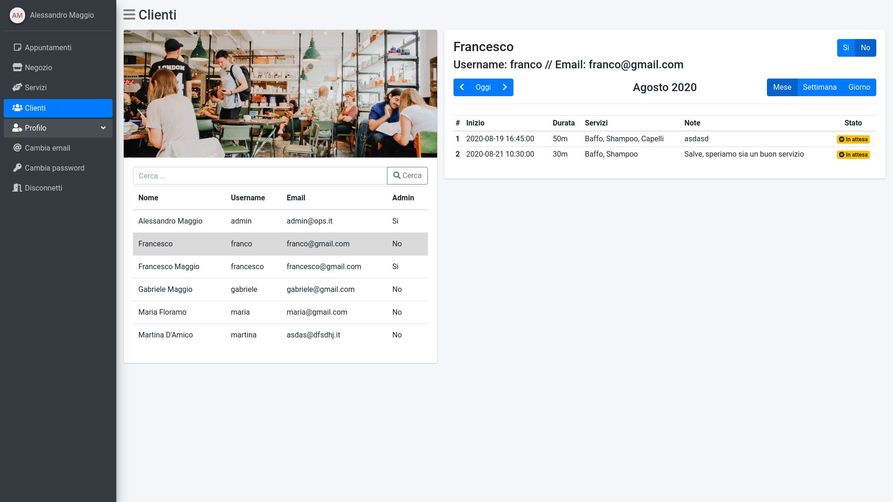
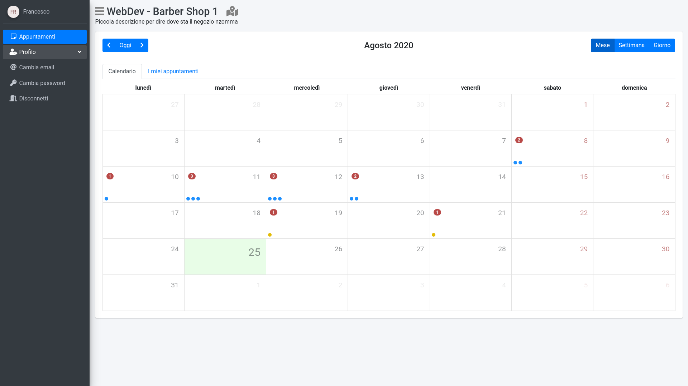

# :date: OPS - Online Planner Service

This web application was developed for help the commercial business to manage their reservations. The owner must be follow the setup section and deploy on own server. After that the admins can be manage all the reservations and the customers can create a new user and ask for new / manage appointment. Contributes are welcome 😄

Some of the technologies used

- https://github.com/pallets/flask
- https://github.com/coleifer/peewee
- https://github.com/angular/angular
___
- https://github.com/mattlewis92/angular-calendar
- https://github.com/vimalloc/flask-jwt-extended
- https://github.com/flask-restful/flask-restful
- https://github.com/ColorlibHQ/AdminLTE


## Setup
### Backend

**[Important!] Make sure to have a mysql database property setup and a empty database**

1. `cd backend`
2. Create the virtualenv: `virtualenv -p python3 env`
3. Activate the venv: `source env/bin/activate`
4. Install all requirements: `pip install -r requirements.txt`

**Settings**
1. Generate the salt for password encryption
```python
python
>>> import bcrypt
>>> bcrypt.gensalt(10)
b'$2b$10$5Ij/lH/3/NcJSPMkf.AKPe'  # Example ...
```
2. Copy the .dist setting to settings.json `cp settings.json.dist settings.json`
3. Edit the settings.json file like this example:
```js
{
	"EMAIL": {
		"SMTP": "smtp.gmail.com",
		"PORT": 587,
		"EMAIL": "youbestemail@gmail.com",
		"PASSWORD": "youbestpassword (i hope)"
	},
	"SALT": "$2b$10$5Ij/lH/3/NcJSPMkf.AKPe",
	/* Copy only the string and not the bytes char (b) */
	"JWT_SECRET_KEY": "lxVYbvu7ZwFNlt1gkx9K",
	/* You can generate a random password here: https://passwordsgenerator.net */
	"DATABASE": {
		"NAME": "ops",
		"USER": "root",
		"PASSWORD": "root",
		"HOST": "127.0.0.1",
		"PORT": 3306
	}
}
```
4. Create the first business and admin just execute the `python initdb.py` and follow the steps
5. Start the service (with venv activate): `python main.py`


### Frontend

1. Navigate to folder: `cd frontend`
2. Install all node_mdoules: `npm i`
3. If you are out of localhost edit the *API_ENDPOINT* variable located at: `src/app/common/constants.ts`
4. Start the service: `ng serve --open` or build the project and host on a web server

## Database schema


## Screenshot and description

<details>
<summary><b style="font-size: 18px">Common area</b>: </summary>




</details>

<details>
<summary><b style="font-size: 18px">Admin</b>: </summary>

Here the admin can set up a general info for business activity and set the timetable of the store.

<details>
<summary>Screenshot</summary>



</details>

___


In this page the admin can create/edit/delete the services offered by the business.\
Each service must have a name and can have description, duration and price.

<details>
<summary>Screenshot</summary>



</details>

___


The core of the project. \
The calendar where the admin can see all reservation and create a new one or edit a existing reservation. \
With the edit option obviously the admin can approve or reject the reservation.

<details>
<summary>Screenshot</summary>






</details>

___


In this page the admin can search for a customer, see the related info and the reservation history.

<details>
<summary>Screenshot</summary>



</details>
</details>

<details>
<summary><b style="font-size: 18px">User</b>: </summary>

The user dashboard is a small version of plans page for admin, obviously with less privileges.

<details>
<summary>Screenshot</summary>



</details>

</details>
